<div align="center">


<p>
  
  
  
  
</p>

<p>
  
  
  
  
  
  
  
  
  
  
</p>

<br/>

> ### Every AI prospecting tool writes a beautiful account list. None of them can prove a single line of it.
> Aerion finds companies by measuring the physical ground they operate on, names people only from the page that
> names them, and refuses, on screen, wherever a source does not exist. The language model is never allowed to
> state a fact.

<br/>

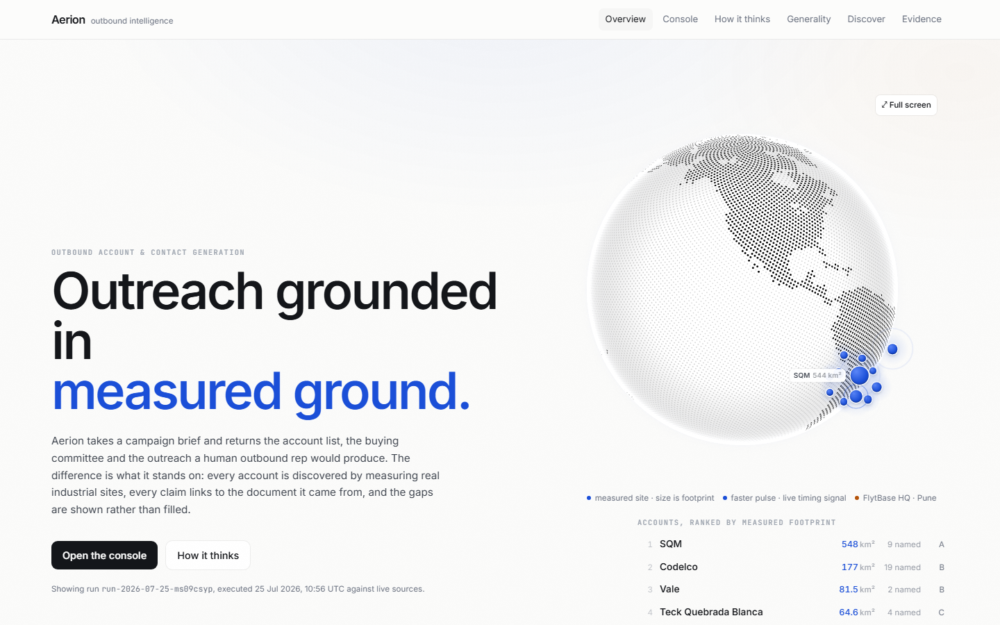

</div>

---

## Table of Contents

- [The Problem](#the-problem)
- [What I Built](#what-i-built)
- [Run It Locally](#run-it-locally)
- [A Guided Tour](#a-guided-tour)
- [The Four Stages of the Brief](#the-four-stages-of-the-brief)
- [Eleven Critic Gates](#eleven-critic-gates)
- [The Attribution Ladder](#the-attribution-ladder)
- [The Revenue Case, and Its Honest Limit](#the-revenue-case-and-its-honest-limit)
- [Novelties and Feature Highlights](#novelties-and-feature-highlights)
- [Architecture](#architecture)
- [Tech Stack](#tech-stack)
- [Data Model](#data-model)
- [Vertical Packs](#vertical-packs)
- [What Went Wrong, and What It Cost](#what-went-wrong-and-what-it-cost)
- [Honesty Constraints, Enforced in Code](#honesty-constraints-enforced-in-code)
- [Project Structure](#project-structure)
- [Author](#author)

---

## The Problem

Ask any AI for twenty large lithium mines in Latin America with their heads of operations. You will get a
beautiful list in four seconds. Some of it is real. Some of it is invented. **You cannot tell which, and neither
can the person who receives your email.**

That is not a prompt-engineering problem. It is structural. A model that has read the internet will produce a
plausible Chilean mine, a plausible site director and a plausible safety statistic with exactly the same
confidence, because fluency and truth are not connected inside it.

The hackathon brief makes the stakes explicit: **fabricated data or invented personas are an automatic
disqualifier.** So the design question was not "how do I make the output better". It was:

> What would make a reviewer believe an account list they have never seen before?

The answer had to be something a model cannot produce. A hole in the ground with coordinates. A filing with a
date. A disclosure a government compels a company to publish.

---

## What I Built

A deployed system that takes a campaign brief and returns the account list, the buying committee, a research
brief per account and a personalised email per contact, with a hard line drawn through the middle of it.

```
Measure  ->  Attribute  ->  Research  ->  Qualify  ->  Write  ->  Attack  ->  Hand off
OSM       operator tag   filings and   deterministic  model,   eleven     AE brief,
geometry  name, then     statutory     ICP score,     prose    gates,     CRM export,
geodesic  proximity      disclosures   sizing, money  only     4 repairs  consented send
area      ladder         dated events  case
```

- **Accounts discovered from terrain**, not from a model's memory. 157 features measured, 964.5 km² of footprint.
- **A four-rung attribution ladder** that labels, per site, how the operator was established.
- **Risk-factor mining** of each company's own annual filing, including a technology signal made of an absence.
- **A type-enforced evidence ledger**: an uncited fact is a compile error, not a code review comment.
- **Deterministic ICP scoring** on published weights, with per-dimension contribution bars.
- **A revenue case** whose every input is labelled published, derived, or the reader's own to supply.
- **An adversarial critic** with eleven gates that displays the drafts it rejects.
- **Live discovery**: name any place and any vertical on earth and watch it measure, then take a discovered
  operator through contacts, scoring and a critiqued email.
- **A question box** that answers only from rows the run established, and refuses otherwise.
- **A null-result register**: every source attempted, what failed, and how I would fix it.
- **A premium light interface** with a white dotted WebGL globe, satellite maps and real polygons.

---

## Run It Locally

Self-contained. The repository ships a real, timestamped run artifact, so the whole application works with no
keys at all. Keys unlock the live paths.

```bash
git clone https://github.com/atharva-awade/flytbase-outbound-hackathon-2026.git
cd flytbase-outbound-hackathon-2026

pnpm install
cp .env.example .env.local        # optional, see the table below
pnpm build                        # runs the prose guard and the attribution tests first
pnpm start                        # http://localhost:3000
```

Open **http://localhost:3000**, click **Open the console**, then any account. Click a citation chip and watch a
real SEC filing open. Then go to **Discover** and measure somewhere nobody chose in advance.

| Variable | What it unlocks | Without it |
|---|---|---|
| `GROQ_API_KEY` | Email prose and the question box | Facts render unedited; the absence is recorded |
| `NVIDIA_API_KEY` | Failover for the above | Groq alone |
| `SERPER_API_KEY` | Public-profile contact discovery | Statutory and company sources only |
| `MAPTILER_KEY` | Satellite basemap | Falls back to keyless Esri World Imagery |
| `GMAIL_USER` + `GMAIL_APP_PASSWORD` | Real send to an address you type | The UI says no mailbox is configured |
| `SUPABASE_URL` + `SUPABASE_SERVICE_ROLE_KEY` | Persisting live discoveries | Local file driver, or an honest "not persisted" |

To regenerate the run from live sources:

```bash
pnpm harvest                      # writes data/run-latest.json and data/outreach.json
pnpm test:employer                # 9 assertions on the contact attribution guard
pnpm lint:dashes                  # fails if a prose tell reached anything we wrote
```

---

## A Guided Tour

### The thought process, before the code

Colour coded by trust: green is measured by ordinary code and reproducible by hand, purple is the only place a
language model is allowed, amber is a decision, and red is the system refusing to do something rather than
filling a gap with something plausible. Served from the deployment at **`/mindmap.html`**.

<p align="center">
  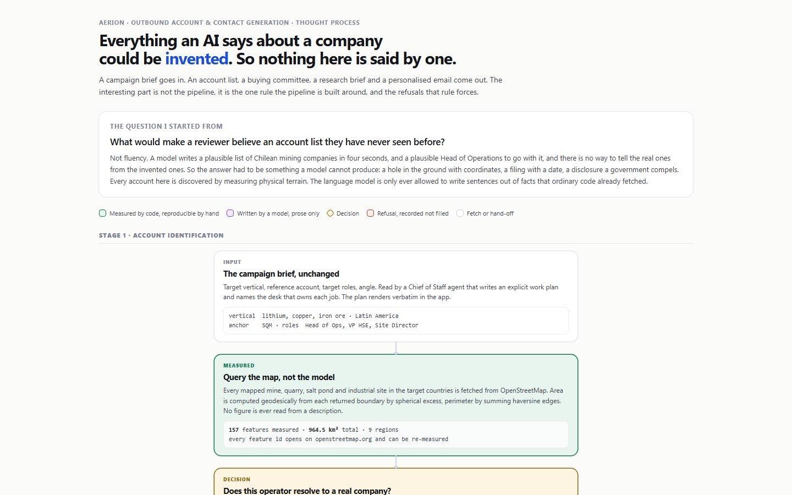
  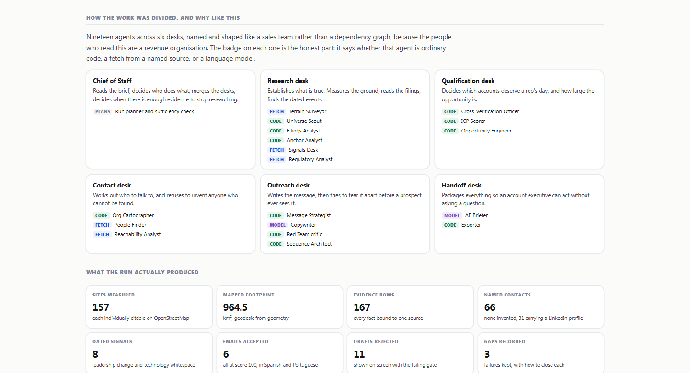
</p>

The same organisation is live at **`/how-it-thinks`**, animated against the recorded run, where each specialist
opens to show its plain-language job, the tools it called, its raw output and its latency. Including the one that
rejects work and hands it back.

<p align="center">
  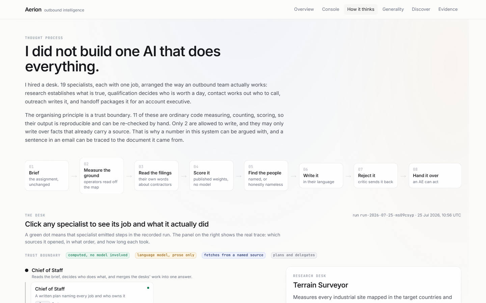
</p>

### Ask the run a question, and watch it refuse

Retrieval is deterministic code that runs before the model is called, so the model has nothing else to draw on.
Ask who runs Chuquicamata and it names the officer with the statutory disclosure behind it. Ask about oil rigs in
the North Sea and it refuses, then offers to go and measure the North Sea.

<p align="center">
  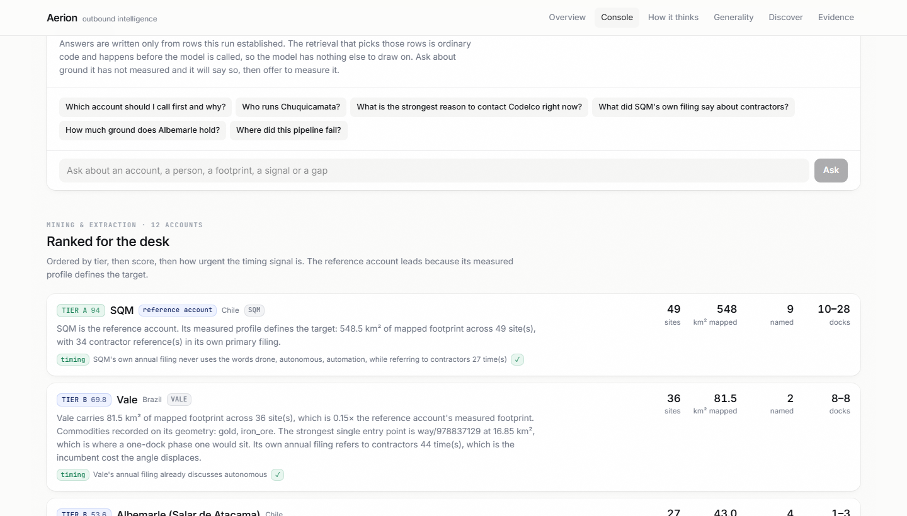
</p>

### Measured ground, on satellite imagery

Not a logo and a company description. The actual polygon, with its area computed geodesically from the returned
boundary, and an attribution split that tells you which figure is defensible in a first conversation.

<p align="center">
  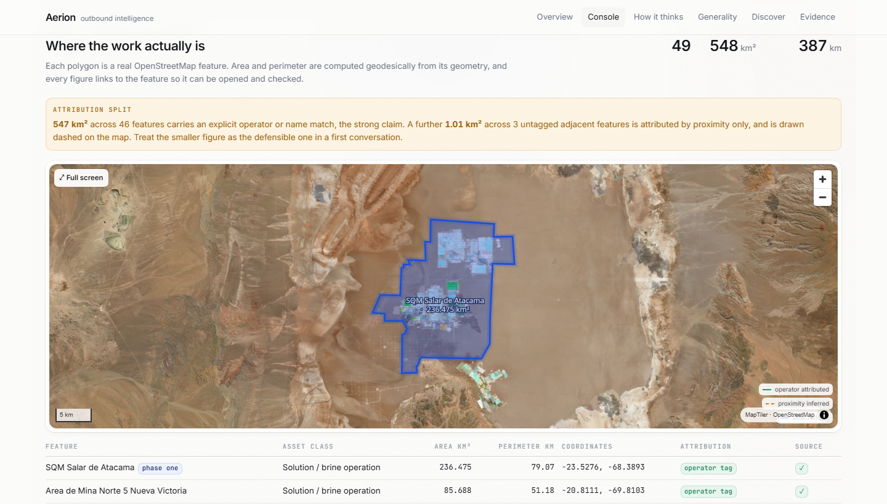
</p>

### The money case, with every figure labelled

Three kinds of number, and the labels are the point. Published with a source. Computed from measured ground.
Or the reader's own to supply, marked unsourced everywhere it appears.

<p align="center">
  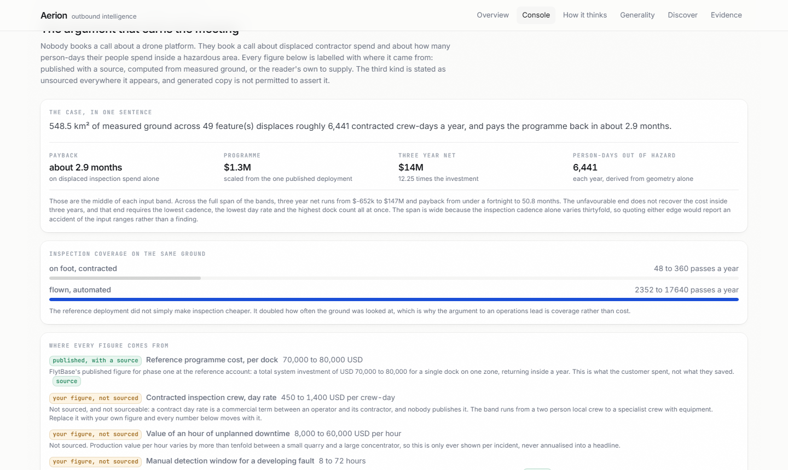
</p>

### The buying committee, and the outreach that came from it

Real names with their exact titles quoted in the language they were published in, LinkedIn where findable, and
the seats that answer the brief's three named roles marked. Then the email, composed natively in Spanish or
Portuguese, followed by the drafts the critic threw away.

<p align="center">
  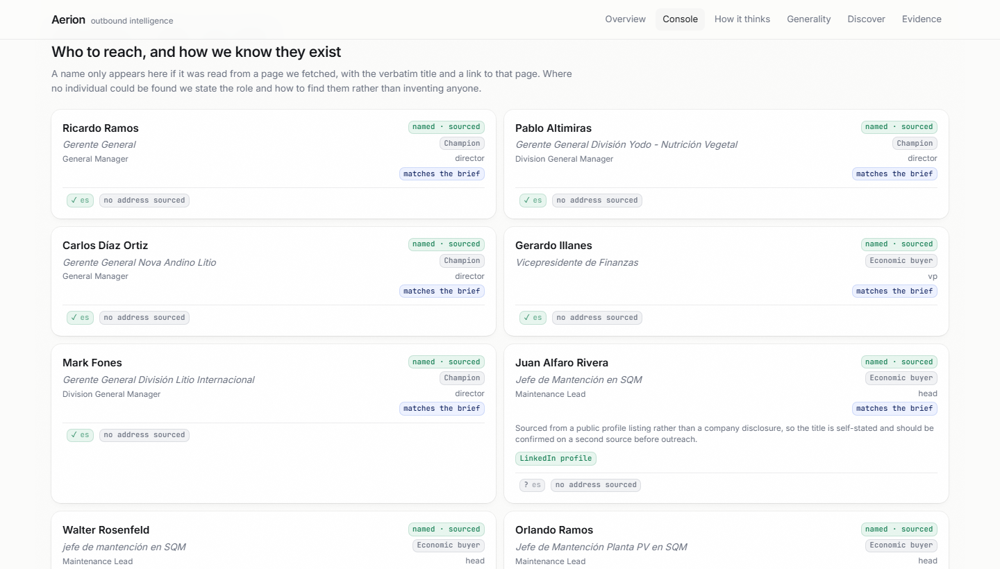
  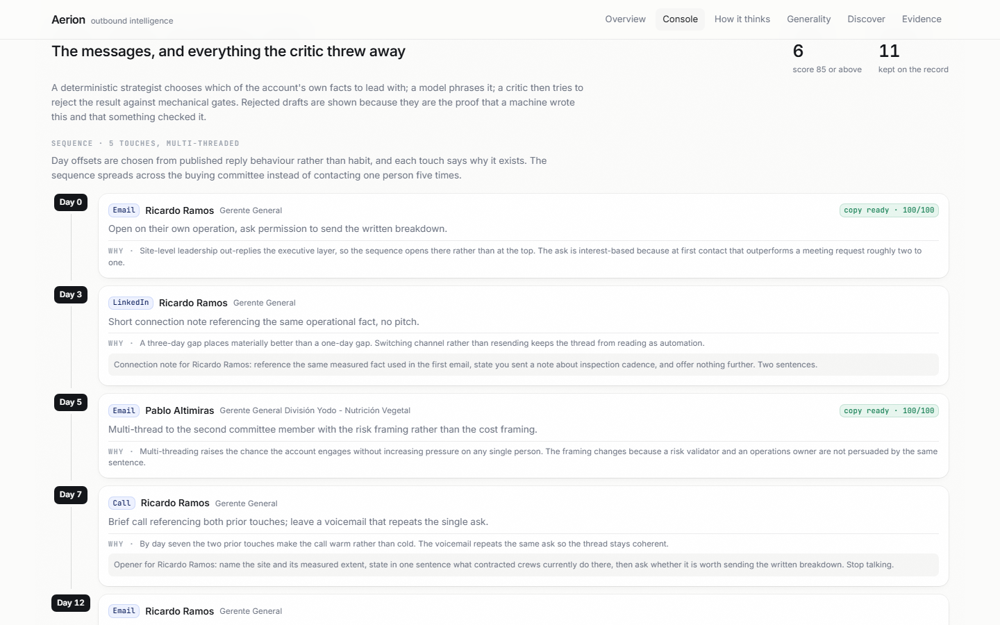
</p>

### Live discovery, on ground nobody chose in advance

The answer to the only question a frozen result cannot address. Name a place and a vertical, watch it resolve,
measure and attribute, then take one operator all the way to a critiqued email.

<p align="center">
  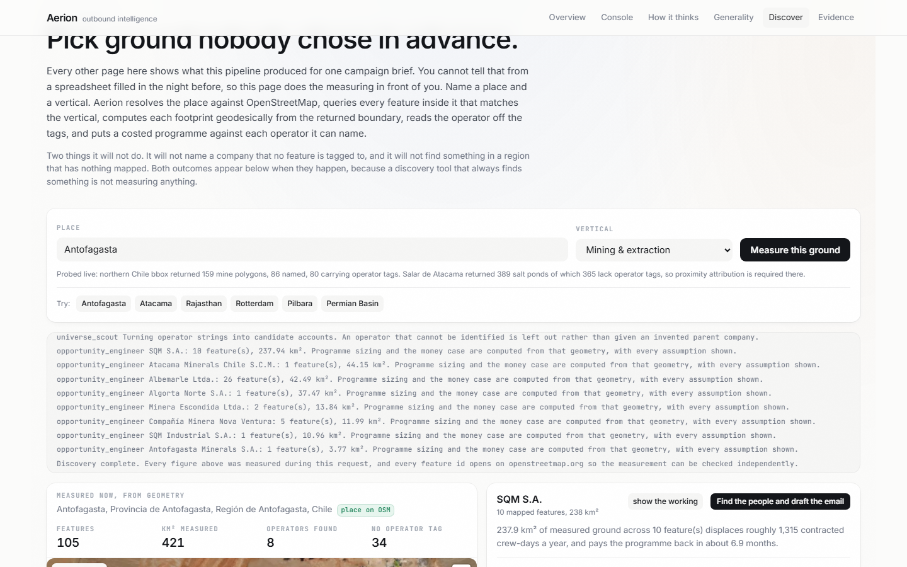
  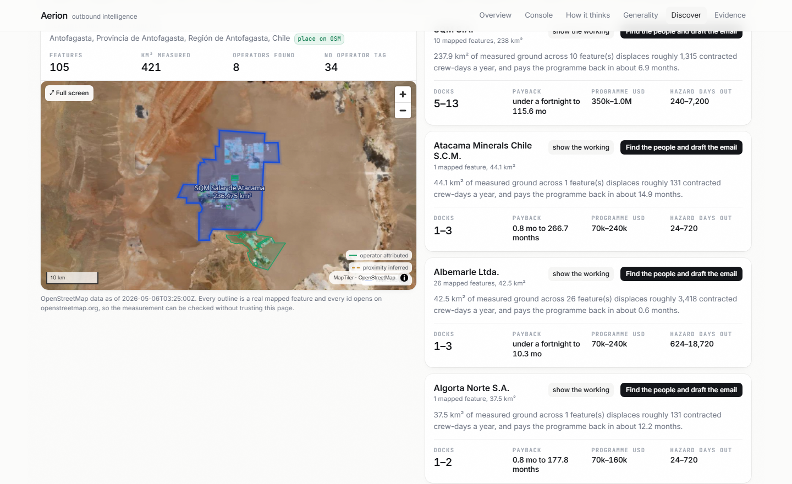
</p>

### The evidence ledger, and the register of failures

Every fact, its source, its verbatim snippet and its confidence. Alongside it, the gaps: what was attempted,
what failed, and what would close it.

<p align="center">
  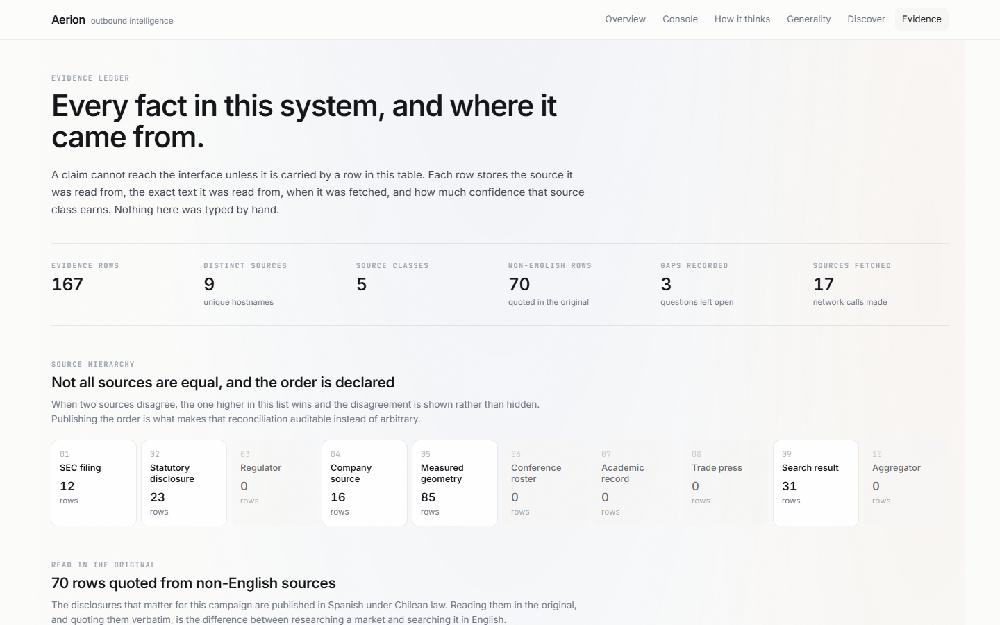
  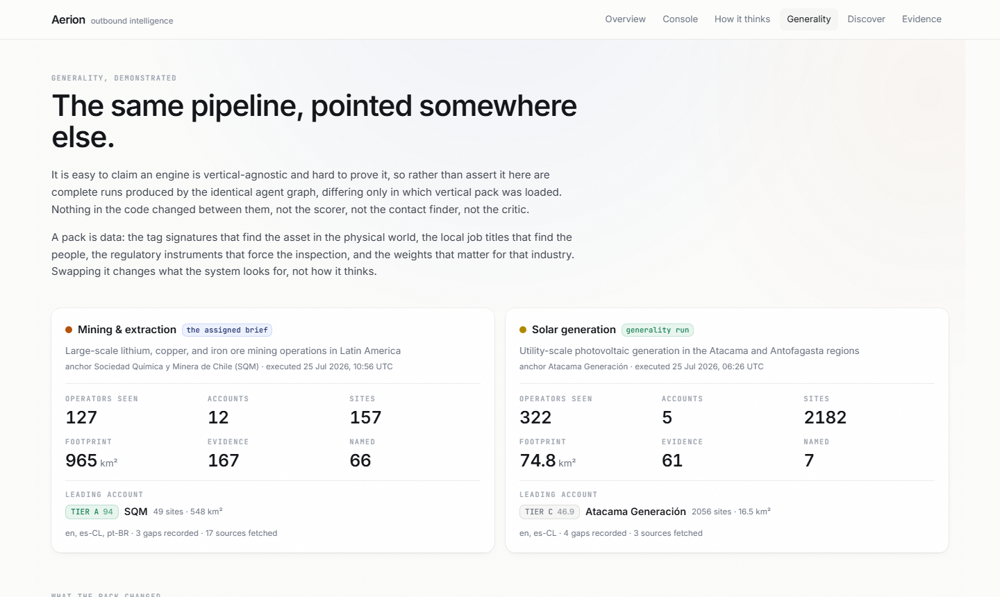
</p>

---

## The Four Stages of the Brief

| Stage | What the brief asks | How this answers it |
|---|---|---|
| **1 Account identification** | Companies of similar scale, operations and geography to the reference account, with ICP reasoning against verifiable signals | Every account is a measured footprint with an operator read off the map. A fabricated company is structurally impossible. Scoring is ten weighted dimensions of visible arithmetic |
| **2 Contact discovery** | Role, seniority, name, LinkedIn or email where findable, aligned to Head of Operations, VP of HSE or Site Director | 66 named contacts, 31 carrying a LinkedIn profile, each with the page that names them and a provenance tier. The seats matching the brief's roles are marked. Where nobody is findable, the seat renders with no name and a playbook |
| **3 Account research** | Recent news, operational footprint, signals of technology investment or expansion, connected to the FlytBase angle | Footprint measured. Events dated and cited. Technology signals read from the filing, including SQM's own filing never using the words drone, autonomous or automation while citing contractors 27 times |
| **4 Personalised email** | Specific to the contact and company, reflecting Stage 3, human, referencing FlytBase's real customer base | Composed natively in Spanish or Portuguese from that account's own facts. All 6 accepted emails name Anglo American as a peer, enforced by a gate whose second half forbids attributing any figure to the wrong customer |

---

## Eleven Critic Gates

The writer produces a draft. This tries to destroy it, and the rejects are displayed
(`src/lib/critic.ts`). Threshold 85 out of 100, up to four repairs, each told exactly which gate failed.

| # | Gate | Why it exists |
|---|---|---|
| G1 | No placeholder token | `{first_name}` is mail merge, not personalisation, and the brief disqualifies it |
| G2 | No banned phrasing, zero em dashes | The clearest signatures of generated prose |
| G3 | Length and sentence discipline | 55 to 95 words replies at 9.7 per cent against 1.9 for 200-plus |
| G4 | At least two cited specifics | One is an anecdote, two is research |
| G5 | Exactly one interest-based ask | Interest-based CTAs reply at 12 per cent against 7 for a meeting ask |
| G6 | Readability on the right scale | Fernandez-Huerta for Spanish and Portuguese, not Flesch-Kincaid |
| G7 | Reader-centred and signed | Second person must outweigh first |
| G8 | **Every numeral traceable** | Added after a draft invented "27 incidentes de seguridad" from a mention count |
| G9 | **Account name spelled correctly** | Added after a draft wrote "Codelgo" |
| G10 | **One language throughout** | Added after English was pasted into Spanish copy |
| G11 | **Peer named, figures correctly attributed** | The brief asks for FlytBase's customers. The second half stops SQM's results being credited to Anglo American |

---

## The Attribution Ladder

OpenStreetMap gives an operator string, not a corporate identity. The rung used is labelled per site, and
proximity-inferred ground is drawn dashed and totalled separately from tagged ground.

| Rung | Method | Strength |
|---|---|---|
| 1 | `operator` tag on the feature | The strong claim |
| 2 | Site name matches the company | Strong |
| 3 | Untagged feature inside a confirmed footprint | Inferred, drawn dashed, counted apart |
| 4 | Unattributed | Counted and reported, never assigned |

**Example, live on the SQM account page:** 547 km² across 46 features carries an explicit operator or name match.
A further 1.01 km² across 3 untagged adjacent features is dashed. The page tells you to quote the smaller figure
in a first conversation.

---

## The Revenue Case, and Its Honest Limit

Programme sizing answers how many docks, which is an engineering answer. Nobody books a call about a drone
platform, so each account also carries the argument its recipient is measured on (`src/lib/revenue.ts`).

| Kind | Meaning | Example |
|---|---|---|
| **Published** | Somebody published it, source linked | FlytBase's own USD 70,000 to 80,000 phase one figure |
| **Derived** | Arithmetic on measured ground, reproducible by hand | 6,441 crew-days a year, 10 to 28 docks |
| **Operator's own** | Nobody publishes it. Marked unsourced everywhere | Contracted crew day rate, value of an hour of downtime |

**Generated copy may never assert an operator-supplied figure**, and the writer is never given them.

Two presentation rules exist because the first version broke both. A payback that rounds to zero months now reads
"under a fortnight", because an obviously broken figure costs more trust than a modest one earns. And the quoted
case uses the geometric mean of each band rather than its edges, because multiplying the extremes of several
independent wide bands produced "minus 652 thousand to 147 million dollars" and a return of "0.71 to 211 times".
Both ends were arithmetically true and the pair said nothing. The full span stays on the page, labelled as a span.

---

## Novelties and Feature Highlights

| Feature | What it does |
|---|---|
| **Terrain-grounded discovery** | Accounts come from measured polygons, so a hallucinated company cannot enter the list |
| **Type-enforced citations** | `Cited<T>` makes an uncited fact a compile error. The ledger is not a convention, it is the type system |
| **Technology signal from an absence** | Zero mentions of drone, autonomous or automation in a filing that cites contractors 27 times is the company saying this is greenfield, in a document its lawyers signed |
| **Contact provenance tiers** | Statutory disclosure, company page, public profile, or explicitly no name found. A tier-3 record beats a plausible invention and the UI says so |
| **Adversarial critic with visible rejects** | Eleven gates, four repairs, and the failures on screen. Proof the machine wrote it, and proof of the quality bar |
| **Conflict reconciliation** | FlytBase says 678 km², we measure 238 km². Both shown, both explained, trust order stated |
| **Live discovery anywhere** | Any place, any vertical, measured during the request, including the honest negatives |
| **Grounded question box** | Deterministic retrieval before the model, capped at three facts per kind, refuses what it has not measured |
| **Live re-run with SSE trace** | Re-executes one account against live sources and streams every query, URL and conclusion |
| **Null-result register** | Every wall the pipeline hit, with remediation. The brief asked; almost nobody complies |
| **Prose-tell build guard** | The build fails on an em dash in anything we wrote, exempting real quotations by field name |
| **Premium light interface** | White dotted WebGL globe with account-level marks, satellite maps, real polygons, nested overlays that hand Escape to the top layer only |

---

## Architecture

```mermaid
flowchart LR
  subgraph Inputs["Inputs"]
    BRIEF["Campaign brief<br/>vertical, anchor, roles, angle"]
    LIVE["Live discovery<br/>any place, any vertical"]
  end

  subgraph Research["Research desk"]
    OSM["Overpass geometry<br/>geodesic area"]
    LADDER["Attribution ladder"]
    SEC["SEC EDGAR<br/>risk-factor mining"]
    STAT["Statutory disclosures<br/>Ley 20.285"]
    SERP["Public profiles<br/>SERP title as evidence"]
  end

  subgraph Qual["Qualification desk"]
    XVER["Cross-verification<br/>conflicts surfaced"]
    ICP["ICP scorer<br/>ten published weights"]
    SIZE["Opportunity sizing"]
    MONEY["Revenue case<br/>three-way provenance"]
  end

  subgraph Out["Outreach desk"]
    STRAT["Message strategist<br/>angle, peer, language"]
    WRITE["Copywriter<br/>the only model call"]
    CRIT["Red Team critic<br/>eleven gates"]
    CAD["Sequence architect"]
  end

  subgraph Hand["Handoff"]
    AE["AE brief"]
    EXP["CRM export"]
    SEND["Consented send"]
    STORE["Supabase"]
  end

  BRIEF --> OSM
  LIVE --> OSM
  OSM --> LADDER --> SEC
  LADDER --> STAT --> SERP
  SEC --> XVER --> ICP --> SIZE --> MONEY
  SERP --> STRAT
  MONEY --> STRAT --> WRITE --> CRIT
  CRIT -- rejected --> WRITE
  CRIT -- accepted --> CAD --> AE --> EXP --> SEND
  MONEY --> STORE
```

**The trust boundary runs through the middle of this diagram.** Everything in Research and Qualification is
ordinary code fetching named sources and doing arithmetic. Exactly one node, the Copywriter, is a language model,
and it receives a numbered list of already-sourced facts and is told it has no other knowledge.

---

## Tech Stack

<table>
<tr>
<td valign="top" width="50%">

### Data and Reasoning
| Layer | Technology |
|---|---|
| Geometry | OpenStreetMap Overpass, mirror-rotated |
| Area and perimeter | Spherical excess, haversine |
| Geocoding | Nominatim, throttled and cached |
| Filings | SEC EDGAR full-text and submissions |
| People | Statutory rosters, company pages, Serper |
| Models | Groq, NVIDIA NIM failover |
| Scoring | Deterministic, no model in the path |
| Persistence | Supabase REST, local file driver |
| Email | nodemailer over Gmail SMTP |

</td>
<td valign="top" width="50%">

### Interface and Experience
| Layer | Technology |
|---|---|
| Framework | Next.js 16 App Router, TypeScript |
| Styling | Tailwind CSS 4, bespoke light token set |
| Maps | MapLibre GL, MapTiler with Esri fallback |
| Globe | cobe, WebGL, account-level marks |
| Motion | Framer Motion |
| Live | Route Handler SSE, heartbeat, no buffering |
| Verification | Playwright, every route at two widths |
| Guards | Prebuild prose and attribution tests |

</td>
</tr>
</table>

---

## Data Model

Typed in `src/lib/types.ts`, and the types are the enforcement mechanism.

- **`EvidenceRow`** the atom: claim, value, unit, source URL, source class, fetch time, verbatim snippet,
  language, translation, confidence, attribution method, producing agent.
- **`Cited<T>`** a value that cannot exist without evidence ids. An uncited fact does not compile.
- **`SiteGeometry`** OSM id, raw tags, closed ring, centroid, area, perimeter, asset class, attribution method,
  exclusion reason.
- **`Account`** identity, commodities, working language, sites, ICP score, signals, anchor comparison, contacts,
  sizing, risk scan.
- **`Contact`** provenance tier, verbatim title, English gloss, seniority, buying role, LinkedIn, email with
  observed or inferred status, and a finding playbook where there is no name.
- **`IcpScore`** total, tier, per-dimension raw, weight and contribution, plus stated disqualifiers.
- **`EmailDraft`** subject, body, language, model, iteration, gate results, cited facts, accepted flag.
- **`NullResult`** subject, question, every source attempted with its outcome, interpretation, remediation.
- **`RevenueCase`** inputs classed published, derived or operator, a central case, the full span, derivation
  lines and caveats.

---

## Vertical Packs

A pack is data, not code. The same engine runs any of them, and a second was run end to end with nothing in the
code changed between them, which the **`/generality`** page shows side by side.

| Pack | OSM signature | Observed operator-tag coverage |
|---|---|---|
| **Mining** (graded) | `landuse=quarry`, `salt_pond`, `industrial` with `resource` | Northern Chile: 159 polygons, 80 tagged |
| Solar | `power=plant` with `plant:source=solar` | Atacama 88 per cent, Rajasthan close to zero |
| Oil and gas | `industrial~oil\|gas\|refinery`, `offshore_platform` | Permian: 14,798 polygons, 4 tagged |
| Ports | `landuse=harbour`, `industrial=port` | Tagged at the terminal, not the port |
| Rail | `landuse=railway`, `railway=yard` | Name-rich, tag-poor |
| Grid | `power=substation`, `power=line` | Sparse |

Coverage varies by more than two orders of magnitude between regions, which is exactly why the attribution ladder
exists and why the rung is labelled per site rather than assumed.

---

## What Went Wrong, and What It Cost

The brief asks to be shown the failures. These are real, and each one changed the code.

### The emails that invented numbers

A draft claimed **"27 incidentes de seguridad"**. No such number exists anywhere. The model had turned "the word
safety appears 27 times in the filing" into 27 incidents. Another said the customer was **"ahorrando 70k"**,
saving 70 thousand, when the real figure is what they **spent**. A third wrote **"Codelgo"**.

All three passed the original gates, because those gates checked that facts were *cited*, not that the paraphrase
was *faithful*. That distinction is the most useful thing this project taught me.

**Fixed:** counts are withheld from the writer entirely, quotable outcomes are a fixed closed list, and gates G8
and G9 check every numeral against the permitted set and the account name against its real spelling.

### The bug that appeared three times

A length filter kept silently discarding company names shorter than four characters, which is exactly the shape
of **SQM**, the anchor account of this brief.

It first cost the anchor its measured sites in the terrain attribution normaliser. It reappeared in the operator
merge for live discovery. And it appeared a third time in the contact attribution check, where the name was
thrown away before any test ran, so a live search found **28 genuine profiles and rejected all 28** for "company
not named as the employer" while checking against a name that no longer existed.

Writing a test for it exposed a second fault underneath: stripping the legal form from `SQM S.A.` leaves
`sqm .`, because the word boundary after the final `a` stops the match before the closing dot, and the remnant
poisoned the employer pattern. Multi-word names survived on their token pairs, which is why the failure looked
selective rather than systemic.

**Fixed:** both are asserted in `scripts/test-employer-match.ts`, which runs before every build and checks the
guard in both directions. `SQM` must match when it follows an employer preposition, and a person surnamed Vale
must still not be attributed to Vale S.A. on a surname. Recovering it took named contacts from 55 to 66.

### The map that was invisible

Reported three times and wrong twice by me before I used a real browser. Playwright showed
`.maplibregl-map { position: relative; height: 0px }`. **Tailwind 4 emits its utilities inside `@layer
utilities`, and an unlayered third-party stylesheet beats any layered rule** regardless of specificity or source
order, so MapLibre's own `position: relative` defeated the `absolute` utility and the container collapsed to zero
height with no error anywhere.

**Fixed:** `@import "maplibre-gl/dist/maplibre-gl.css" layer(base)`. I only found it by looking at the computed
styles in a real browser rather than reasoning about the CSS.

### Footprints inflated twofold

Overlapping bounding boxes double- and triple-counted features. SQM read 1,025 km² when the truth was 548.
**Fixed:** dedupe on OSM id before any total is computed.

### A score of 103.4 out of 100

One pack's ICP weights summed to 1.10. The other five were correct, so it was a typo in one object rather than a
flaw in the scorer, but a score out of 100 that reads 103.4 costs a reader their confidence in every other figure
on the page. **Fixed** in the data, and the scorer now normalises whatever weights a pack declares.

### The free tier that produced nothing

Adding two requirements to the writer's prompt pushed every call past the free tier's 8,000 tokens a minute, and
the outreach stage returned zero accepted emails through rate limiting alone. **Fixed:** the prompt says the same
thing in a third of the words, the output budget is large enough for the JSON to close, and calls are paced
between contacts and between repair attempts. Accepted emails went 0, then 2, then 6.

### Walls that are still walls

- The anchor account has the thinnest contact surface in the run. SQM's own leadership page lists five
  executives and no operations or HSE title. That is the headline of the gap register, not a footnote.
- Corporate mail gateways answer for the gateway, so no address can be verified without SMTP probing. Probing
  risks blocklisting and is refused.
- 365 of 389 mapped salt ponds carry no operator tag, so proximity inference is required on that terrain.
- Overpass answers a continental bounding box with a timeout, so live discovery crops to roughly 330 km and says
  so on screen.

### Verified broken, so you do not waste the time

DuckDuckGo HTML and public SearXNG serve bot challenges. Mojeek 403s, Startpage 303s. Exa returns a crypto
payment challenge. Bing Search API is dead. NVIDIA's `llama-3_2-nv-rerankqa-1b-v2` returns 410 Gone while most
tutorials still recommend it. `groq/compound` returns 413 whenever it searches on the free tier. Serper rejects
`num: 20` for free accounts. Every free transactional email sandbox restricts recipients to the account owner,
which is why Gmail SMTP is the only path that can reach a reviewer.

---

## Honesty Constraints, Enforced in Code

- A fact cannot render without an evidence row carrying a source URL and a verbatim snippet.
- A contact without a source URL renders as a nameless role target, never as a name.
- An inferred email address is excluded from every sendable column, because a guess that reaches a CRM becomes a
  real send later by somebody who never saw the warning.
- A regulatory instrument is withheld from generated copy until its text has been fetched. A wrong decree number
  is worse than none.
- Proximity-inferred geometry is reported separately and drawn dashed.
- Sizing and money outputs are ranges, and every assumption is listed with its basis.
- Runs state their execution time. Replay re-serves a recorded real run, never a synthesised one.
- The question box cannot answer outside the run.
- No em dash appears in any text this project wrote. A prebuild guard fails the build if one returns, and the
  critic rejects a draft containing one. Quotations from source documents are exempt and matched by field name:
  an SEC filing writes what it writes, and editing a quote would make the citation stop matching its page.
- `/api/send` and `/api/run` are capped per caller, and sending is capped for the whole deployment, because an
  unauthenticated endpoint that mails an arbitrary address is a relay.
- No secret is ever sent to the browser. Supabase is reached server-side only, with row level security on and no
  anon policy.

---

## Project Structure

```
src/lib/                      geo · icp · sizing · revenue · critic · outreach · ask · store · verticals
src/lib/sources/              sec · people · serp · geocode
src/app/                      landing · console · account brief · discover · how-it-thinks · generality · evidence
src/app/api/                  run · discover · discover/deep · ask · export · send
src/components/               LiveGlobe · SiteMap · Discover · AskPanel · RevenuePanel · Outreach · MindMap
scripts/harvest.ts            the pipeline; writes a frozen run artifact to ./data
scripts/no-em-dash.ts         prebuild guard; fails on a prose tell in anything we wrote
scripts/test-employer-match.ts  prebuild guard; 9 assertions on contact attribution
public/mindmap.html           the thought process, standalone and served from the deployment
supabase/schema.sql           one table for persisted discoveries, row level security on
data/                         frozen run artifacts, real outputs, original timestamps preserved
docs/screenshots/             the images in this file
```

---

## Author

Built for the **FlytBase BDR Hackathon 2026**, Outbound Account and Contact Generation track.

My thesis in one line: every AI prospecting tool writes a beautiful account list, and none of them can prove a
line of it, so I built one that finds companies by measuring the ground they stand on and refuses, on screen,
wherever a source does not exist.

<div align="center">

<br/>

**Atharva Awade**
work.atharva2231@gmail.com

<br/>

**Measured, cited, or refused. Never invented.**


</div>
